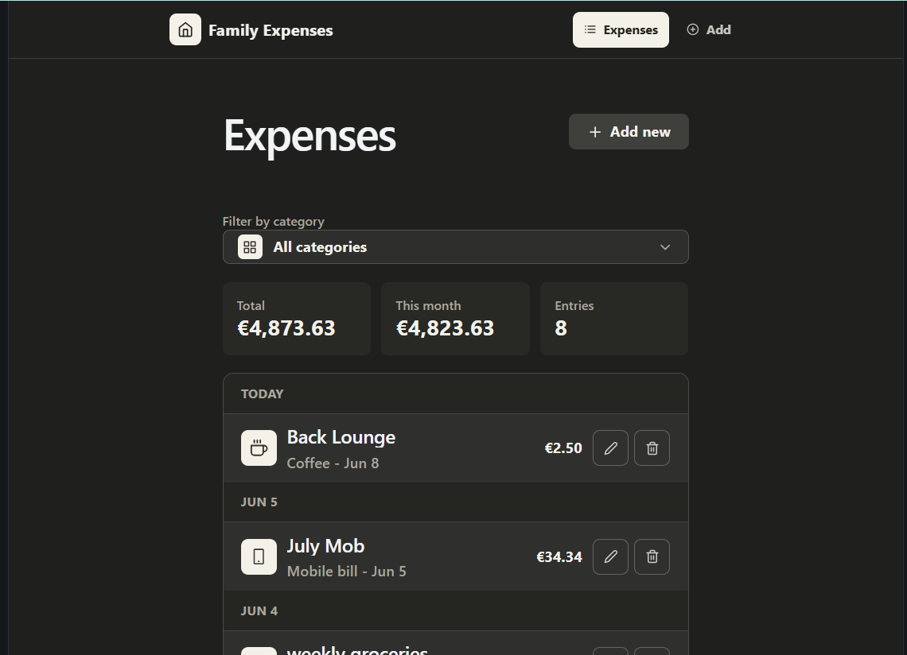
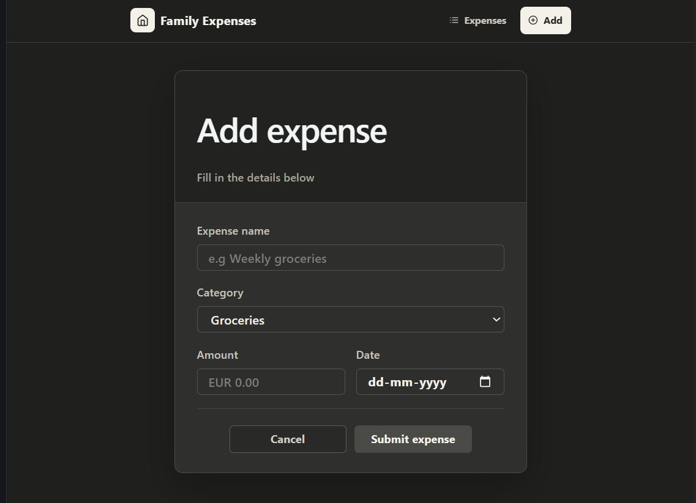
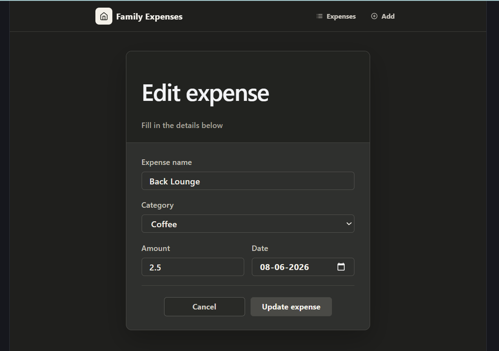
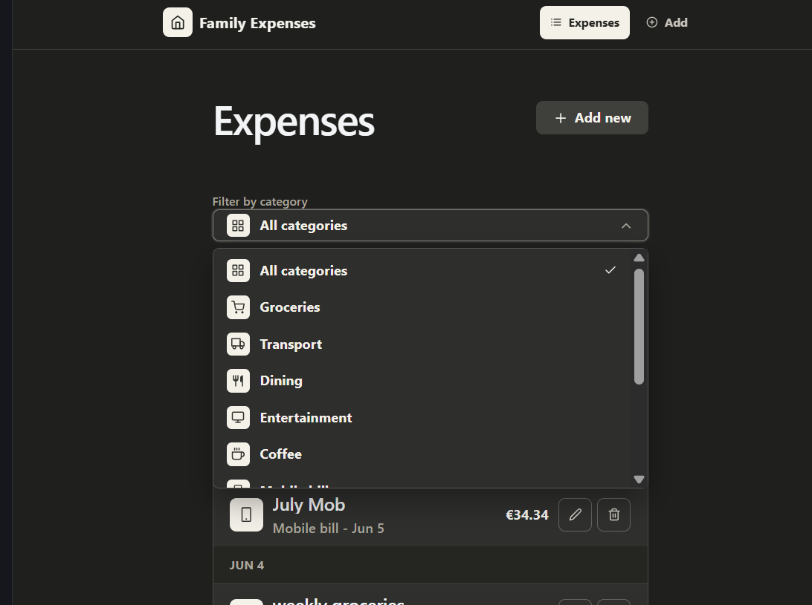

# Family Expense Tracker

A React + TypeScript expense tracking application built to manage daily family expenses. The application supports expense management, category-based filtering, day-wise grouping, and local persistence using browser storage.

## Features:

- Add expenses
- Edit expenses
- Delete expenses
- Filter by category
- Day-wise grouping
- LocalStorage persistence

## Techstack

- React
- TypeScript
- React Router
- Context API
- Vite
- Tailwind CSS

## Architecture

State Management:

- Context API

Persistence:

- Browser localStorage

Routing:

- React Router

## Project Structure

- React Router for navigation
- Context API for global expense state
- localStorage for persistence
- Shared form component for Add/Edit flows
- TypeScript interfaces for type safety

## Future Improvements

- Dashboard with monthly expense analytics
- Expense category breakdown charts
- Cloud persistence using Supabase
- Authentication and multi-user support
- CSV export functionality

## Key Learnings

- Managing shared state using Context API
- Building reusable form components
- Persisting application state using localStorage
- Structuring a multi-page React application
- Working with TypeScript in a real-world project

## Screenshots

### Expense List

### Add Expense

### Edit Expense

### Category Filter

